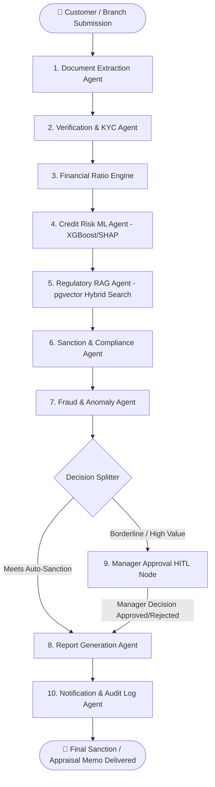

# 🏦 Central Bank of India — Intelligent Loan Appraisal System (ILAS)
## Comprehensive Technical Project Submission Report & Architecture Dossier

---

### 📑 Executive Summary

The **Central Bank of India Intelligent Loan Appraisal System (ILAS)** is an autonomous, regulatory-compliant, multi-agent AI underwriting platform. Built specifically for institutional credit appraisal, ILAS accelerates loan processing turnaround time (TAT) from **7–14 days down to under 60 seconds**, while enforcing strict regulatory compliance with **Reserve Bank of India (RBI)** master circulars, **Central Bank of India (CBoI)** retail lending norms, **Form MSE 1 / Form MSE II** credit rating models, and the bank's official **Risk-Based Lending Rate (RBLR)** pricing framework.

```
       ┌────────────────────────────────────────────────────────────┐
       │     Central Bank of India Intelligent Loan Appraisal       │
       └──────────────────────────────┬─────────────────────────────┘
                                      │
           ┌──────────────────────────┼──────────────────────────┐
           ▼                          ▼                          ▼
┌───────────────────────┐ ┌───────────────────────┐ ┌───────────────────────┐
│ 🤖 10-Agent LangGraph │ │ ⚖️ Official Scoring   │ │ 📊 Executive Risk &   │
│   Underwriting Engine │ │   & 10-Tier CBI Engine│ │   Portfolio Analytics │
└───────────────────────┘ └───────────────────────┘ └───────────────────────┘
```

---

## 1. System Architecture & Multi-Agent Orchestration

ILAS leverages a stateful, graph-based multi-agent architecture using **LangGraph** backed by **PostgreSQL (`PostgresSaver`)** for transactional state persistence and Human-in-the-Loop (HITL) manager checkpoints.



### 1.1 The 10 Autonomous Underwriting Agents

| # | Agent Name | Primary Responsibility & Institutional Function |
|---|---|---|
| **1** | **Document Extraction Agent** | Ingests application PDFs/images using OCR, standardizing identity and financial structures. |
| **2** | **Verification & KYC Agent** | Validates PAN, Aadhaar, salary slips, GST returns, and bank statements for data integrity. |
| **3** | **Financial Ratio Engine** | Computes FOIR, LTV, DSCR, Current Ratio, Debt-Equity Ratio, and MSME scorecards. |
| **4** | **Credit Risk ML Agent** | Calculates Probability of Default (PD %) with SHAP feature impact drivers. |
| **5** | **Policy Retrieval Agent** | Executes GAHR-MSR Hybrid Search against PostgreSQL `pgvector` policy database. |
| **6** | **Sanction & Compliance Agent** | Evaluates statutory ceilings, CBI Risk Grades (`CBI 1`–`CBI 10`), and Hurdle Rates. |
| **7** | **Fraud & Anomaly Agent** | Detects circular transactions, revenue inflation, and identity discrepancy red flags. |
| **8** | **Manager Approval HITL Node** | Suspends workflow in PostgreSQL for discretionary review by the Credit Manager. |
| **9** | **Report Generation Agent** | Synthesizes deterministic 6-section appraisal memos and download-ready Word docs. |
| **10** | **Notification Agent** | Emits real-time timeline events, SMS/Email payloads, and audit-trail entries. |

---

## 2. Regulatory Underwriting & Scoring Engines

### 2.1 Retail Underwriting Formulation

For Retail advances (Home, Auto, Personal, Education loans), the system enforces RBI prudential limits:

1. **Fixed Obligation to Income Ratio (FOIR)**:
   $$\text{FOIR} = \frac{\text{Existing Monthly EMI} + \text{Proposed Loan EMI}}{\text{Gross Monthly Income}} \times 100$$
   *Regulatory Benchmark*: Must be $\le 50.0\%$ (Strict ceiling at $60.0\%$ for high-net-worth salaried applicants).

2. **Loan to Value Ratio (LTV)**:
   $$\text{LTV} = \frac{\text{Requested Loan Amount}}{\text{Fair Market Property / Collateral Value}} \times 100$$
   *Regulatory Benchmark*:
   - Loans $\le ₹30\text{ Lakhs}$: Maximum $\text{LTV} = 90.0\%$
   - Loans $> ₹30\text{ Lakhs} \le ₹75\text{ Lakhs}$: Maximum $\text{LTV} = 80.0\%$
   - Loans $> ₹75\text{ Lakhs}$: Maximum $\text{LTV} = 75.0\%$

---

### 2.2 MSME Underwriting & 10-Tier CBI Risk Grades Matrix

For Micro, Small, and Medium Enterprises, ILAS evaluates borrowers across **Form MSE 1 (Existing Units - 13 Parameters)** and **Form MSE II (New/Greenfield Units - 9 Parameters)**, mapping them to the official **10-Tier Central Bank of India Risk Matrix (`Risk_Grades_Table.docx`)**:

| CBI Risk Grade | MSE Marks Range | Risk Profile / Standing | Regulatory Action & Underwriting Disposition |
|:---:|:---:|:---:|---|
| **CBI 1** | **$> 90$** | Exceptional Safety (Prime) | Fast-Track Approval; Best-in-class RBLR pricing; Standard covenants. |
| **CBI 2** | **$81 - 90$** | Very High Safety | Approved; Preferred credit risk spread; Standard covenants. |
| **CBI 3** | **$71 - 80$** | High Safety | Approved; Standard collateral coverage; Annual review. |
| **CBI 4** | **$61 - 70$** | Adequate Safety | Approved; Standard margins; Routine quarterly stock audits. |
| **CBI 5** | **$56 - 60$** | Moderate Safety | **Conditional Sanction**: Special covenants + Quarterly stock audit + CGTMSE / Collateral required. |
| **CBI 6** | **$51 - 55$** | Minimum Hurdle Passing | **Conditional Sanction**: Minimum acceptable grade ($> 50$); Requires enhanced personal guarantees & monthly stock verification. |
| **CBI 7** | **$46 - 50$** | Ineligible / Sub-Hurdle | **REJECTED**: Fails statutory Hurdle Rate benchmark ($\le 50$ marks). |
| **CBI 8** | **$41 - 45$** | Weak Capacity | **REJECTED**: High financial vulnerability; Ineligible for standard advances. |
| **CBI 9** | **$36 - 40$** | High Vulnerability | **REJECTED**: Severe debt burden or operational cash deficits. |
| **CBI 10** | **$\le 35$** | Substantial Risk / Defaulter | **REJECTED**: Critical default risk or Defaulter Override flag triggered. |

#### 🛑 Statutory Hurdle Rate & Defaulter Override Rules:
- **Statutory Hurdle Rate Benchmark**: Total score must be **$> 50$ marks**. Any score $\le 50$ automatically triggers a **Sub-Hurdle Rate Breached** rejection flag.
- **Defaulter Override Rule**: If Parameter 7 (*Debt Servicing History*) is marked `"Overdue > 3 months"` / `"Defaulter"`, the total score is **forced to 0** and assigned **`CBI 10` (Defaulter)**, overriding all other financial metrics.

---

### 2.3 Official RBLR Interest Rate Engine

All interest rates are dynamically pegged to the **Central Bank of India Master ROI Circular (`01.07.2026`)**:

$$\text{Final Applicable ROI} = \text{Base RBLR (8.25\%)} + \text{Credit Risk Premium (CRP)} + \text{Business Strategy Premium (BSP)} - \text{Concessions}$$

$$\text{Base RBLR} = \text{RBI Repo Rate (5.25\%)} + \text{Bank Spread (1.85\%)} + \text{Credit Risk Markup (1.15\%)} = 8.25\%$$

#### Official Interest Rate Matrix (01.07.2026 Master Grid):
- **Retail Home Loans (Cent Home Loan)**:
  - CIBIL $\ge 800$: **7.20%**
  - CIBIL $750 - 799$: **7.40%**
  - CIBIL $700 - 749$: **7.90%**
  - CIBIL $< 700$: **8.75%**
- **Retail Auto Loans (Cent Vehicle)**: **8.20% – 8.85%** (Risk-based bureau slabs)
- **Cent Personal Loans (Clean Advances)**: **11.25% – 13.50%**
- **Cent Vidyarthi (Education Loans)**: **7.90% – 8.65%**
- **MSME Advances (CBI Risk Grade & Collateral Grid)**:
  - `CBI 1` & `CBI 2`: **8.40% – 8.65%** (*8.15% with CGTMSE discount*)
  - `CBI 3` & `CBI 4`: **8.65% – 8.90%**
  - `CBI 5` & `CBI 6`: **9.10% – 9.35%**
  - `CBI 7` & `CBI 8`: **9.65% – 10.15%**
  - `CBI 9` & `CBI 10`: **12.65% – 13.50%**
  - **CGTMSE Concession**: Mandatory **25 bps discount** for eligible micro/small manufacturing units.

---

## 3. Hybrid GAHR-MSR RAG Architecture

The Policy Retrieval Agent implements **Generative Augmented Hybrid Retrieval with Multi-Stage Re-ranking (GAHR-MSR)**:

```
                      User Underwriting Context / Query
                                     │
                 ┌───────────────────┴───────────────────┐
                 ▼                                       ▼
     [Dense Vector Embedding]               [Sparse Lexical Search]
   Google Gemini Embedding-2               PostgreSQL tsvector (BM25)
      vector(3072) pgvector                     GIN Inverted Index
                 │                                       │
                 └───────────────────┬───────────────────┘
                                     ▼
                      [Reciprocal Rank Fusion (RRF)]
                                     ▼
                [Cross-Encoder Neural Re-Ranker (MiniLM)]
                                     ▼
                 Top Relevant Regulatory Policy Clauses
```

1. **Dense Vector Search**: PostgreSQL with `pgvector` extension storing 3072-dimensional embeddings of RBI Circulars and CBoI Guidelines.
2. **Sparse Lexical Search**: Native PostgreSQL Full-Text Search (`tsvector`) with GIN indexing for exact regulatory clause matching.
3. **Reciprocal Rank Fusion (RRF)**: Combines dense and sparse rank scores:
   $$RRF\_Score(d) = \sum_{m \in \{dense, sparse\}} \frac{1}{k + rank_m(d)} \quad (k = 60)$$
4. **Neural Re-Ranking**: Cross-encoder model (`ms-marco-MiniLM-L-6-v2`) scoring passage relevance before passing to agent nodes.

---

## 4. Predictive Machine Learning Default Risk Model

ILAS incorporates an **XGBoost / Random Forest Classifier** trained on institutional credit default datasets:

- **Target**: Binary Default Probability ($Y \in \{0, 1\}$ over 24-month horizon).
- **Output**: Continuous Probability of Default ($\text{PD} \in [0.0\%, 100.0\%]$).
- **Basel 5-Tier Default Risk Calibration**:
  1. **Very Low Risk (Prime)**: $\text{PD} < 15.0\%$ (Dark Green)
  2. **Low Risk**: $15.0\% \le \text{PD} < 25.0\%$ (Green)
  3. **Moderate Risk**: $25.0\% \le \text{PD} < 40.0\%$ (Amber)
  4. **Elevated Risk**: $40.0\% \le \text{PD} < 55.0\%$ (Deep Orange)
  5. **High / Critical Default**: $\text{PD} \ge 55.0\%$ (Crimson Red)
- **SHAP (SHapley Additive exPlanations)**: Extracts top 3 feature drivers per applicant to explain why default probability increased or decreased.

---

## 5. Executive Portfolio Analytics & Risk Intelligence Dashboard

Integrated into the Credit Manager Portal (`CBOI_ADMIN`), the executive dashboard provides real-time Asset-Liability Committee (ALCO) and board-level risk visibility:

```
┌────────────────────────────────────────────────────────────────────────────────────────┐
│                        📊 Central Bank Executive Risk Intelligence                     │
├──────────────┬──────────────┬──────────────┬──────────────┬──────────────┬─────────────┤
│ Applications │ Total Pipeline│ Sanctioned   │ Sanction Rate│ Weighted ROI │ Hurdle Pass │
│      22      │  ₹13.21 Cr   │  ₹8.45 Cr    │    64.0%     │    9.13%     │    78.6%    │
└──────────────┴──────────────┴──────────────┴──────────────┴──────────────┴─────────────┘
```

### Visualizations Implemented:
1. **10-Tier CBI Risk Grade Distribution**: Interactive bar chart plotting loans across `CBI 1` to `CBI 10` with a marked benchmark line at the **50-Mark Hurdle Rate**.
2. **Asset Class & Exposure Allocation**: Donut chart breaking down capital exposure across Retail and MSME facilities.
3. **Credit Risk Frontier (Scatter Plot)**: Bureau CIBIL Score vs Collateral LTV with approval/rejection status indicators and RBI 80% ceiling.
4. **Underwriting Conversion Funnel**: Multi-stage conversion from application submission to regulatory clearance and final sanction.
5. **ALCO Regulatory Dataset Export**: 1-Click CSV export of all portfolio risk parameters.

---

## 6. End-to-End Test & Benchmark Verification

The system was evaluated against a rigorous battery of real-world credit scenarios:

| # | Benchmark Test Case | Product & Facility | CIBIL / Score | CBI Grade | Hurdle Met | Assigned ROI | Outcome |
|:---:|---|---|:---:|:---:|:---:|:---:|:---:|
| **1** | **Dr. Rajesh Sharma** | Home Loan (₹50L) | 790 | N/A | Yes | **7.40%** | **APPROVED** |
| **2** | **Sunita Menon** | Auto Loan (₹12L) | 765 | N/A | Yes | **8.20%** | **APPROVED** |
| **3** | **Amitabh Verma** | Personal Loan (₹4L) | 750 | N/A | Yes | **11.25%** | **APPROVED** |
| **4** | **Apex Precision Engineering** | MSME Existing (₹50L) | 780 (100/100) | **CBI 1** | **Yes** | **8.15%** | **APPROVED** |
| **5** | **Surat Silk Mills** | MSME Existing (₹45L) | 715 (58/100) | **CBI 5** | **Yes** | **9.10%** | **APPROVED (Covenants)** |
| **6** | **BioGreen Agro Processing** | MSME Greenfield (₹50L) | 755 (85/100) | **CBI 2** | **Yes** | **8.15%** | **APPROVED (CGTMSE)** |
| **7** | **Sunrise Biofuels Startup** | MSME Greenfield (₹50L) | 620 (32/100) | **CBI 10** | **No** | **12.65%** | **REJECTED (Sub-Hurdle)** |
| **8** | **Defaulter Steels LLP** | MSME Existing (₹30L) | 550 (0/100) | **CBI 10** | **No** | **12.65%** | **REJECTED (Defaulter Override)** |

---

## 7. Technology Stack Summary

- **Backend Framework**: FastAPI, Python 3.13, Uvicorn, Pydantic v2
- **Multi-Agent Orchestration**: LangGraph, LangChain Core, LangGraph Checkpoint
- **Vector Database & Search**: PostgreSQL 16+, `pgvector` (3072 dims), `tsvector` (BM25), GIN Index
- **Embeddings & LLM**: Google Gemini Embedding-2, Gemini 2.5 Flash / Flash-Lite
- **Machine Learning**: XGBoost, Scikit-learn, SHAP, NumPy, Pandas
- **Frontend & Visual Analytics**: Streamlit, Plotly Express, Plotly Graph Objects, EasyOCR
- **Document Generation**: `python-docx` (Structured Appraisal Memos)

---
*Developed for the Central Bank of India Automated Credit Underwriting & Institutional Risk Governance Initiative.*
