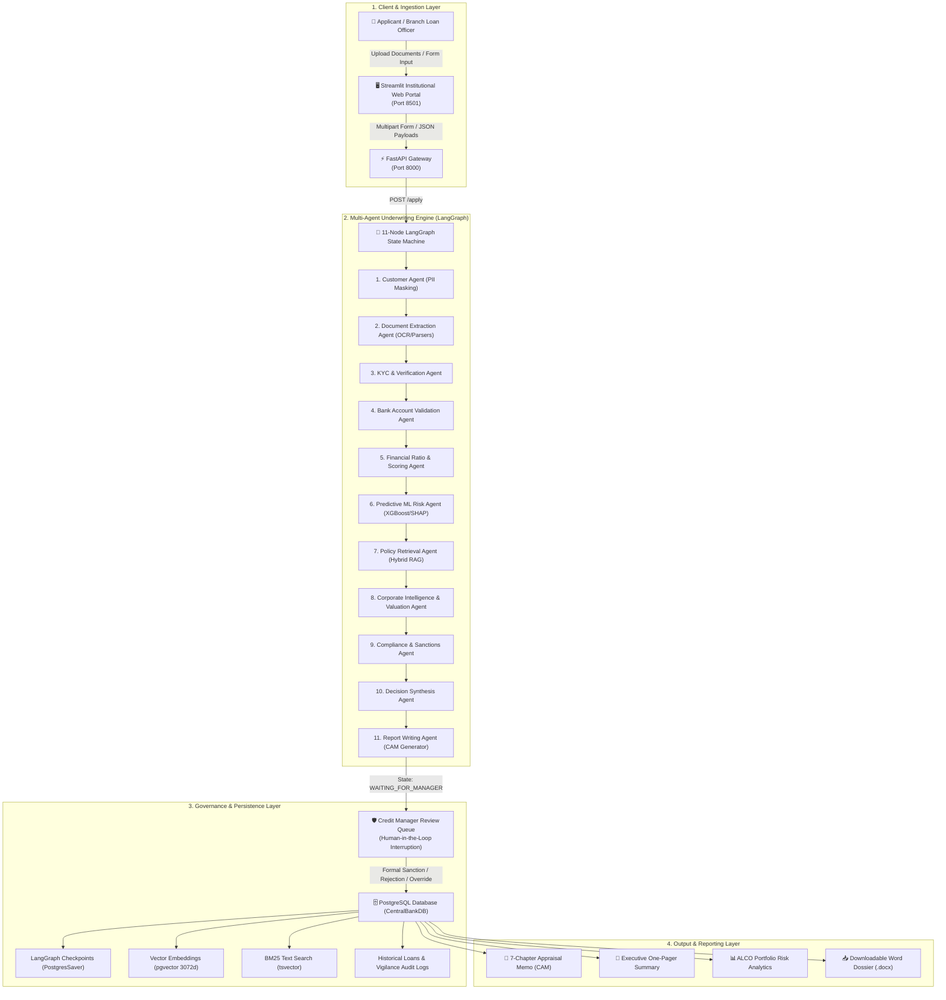
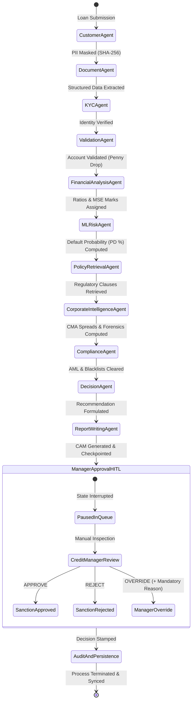
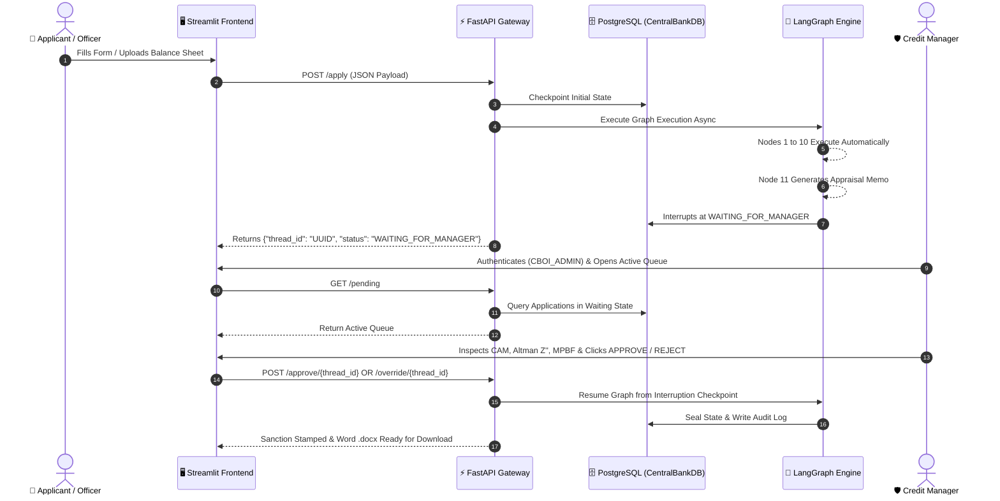
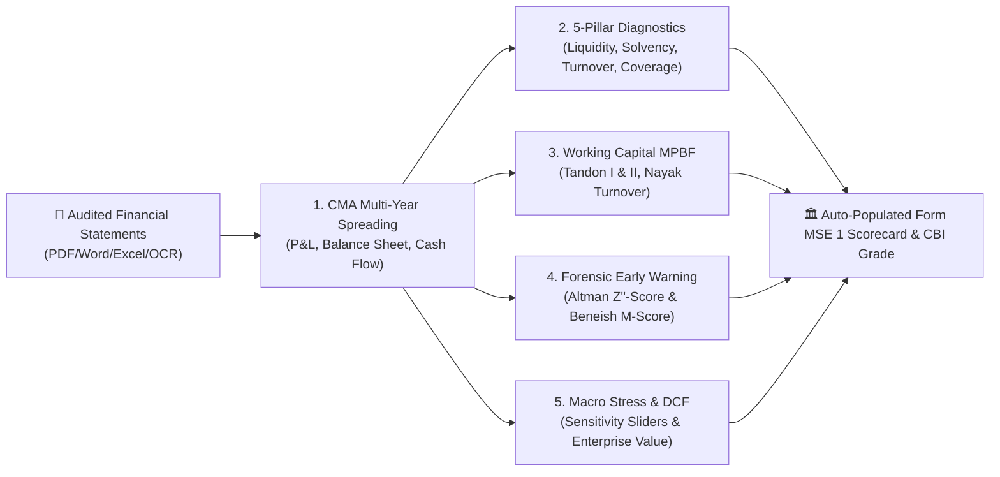

# 🏛️ Central Bank of India — Intelligent Loan Appraisal System (ILAS)
# 📐 Complete System Design, Multi-Agent Architecture & Token Economics Dossier

---

## 📑 Table of Contents
1. [Executive System Overview & Architecture Topology](#1-executive-system-overview--architecture-topology)
2. [End-to-End Multi-Agent Workflow (LangGraph State Machine)](#2-end-to-end-multi-agent-workflow-langgraph-state-machine)
3. [Deep-Dive: The 11 Autonomous Underwriting Nodes](#3-deep-dive-the-11-autonomous-underwriting-nodes)
4. [REST API Architecture & Request Execution Lifecycle](#4-rest-api-architecture--request-execution-lifecycle)
5. [LLM Integration Points & Token Consumption Economics](#5-llm-integration-points--token-consumption-economics)
6. [Data Architecture, PostgreSQL & pgvector Schema](#6-data-architecture-postgresql--pgvector-schema)
7. [Corporate Financial Intelligence, Forensic Audit & DCF Sizing](#7-corporate-financial-intelligence-forensic-audit--dcf-sizing)
8. [Statutory Risk Scoring & Official RBLR Pricing Engines](#8-statutory-risk-scoring--official-rblr-pricing-engines)
9. [Human-In-The-Loop (HITL) Governance & Security Architecture](#9-human-in-the-loop-hitl-governance--security-architecture)

---

## 1. 🏛️ Executive System Overview & Architecture Topology

The **Central Bank of India Intelligent Loan Appraisal System (ILAS)** is an institutional-grade, regulatory-compliant multi-agent credit underwriting engine designed to compress retail and commercial credit turnaround times (TAT) from **7–14 days to under 60 seconds**.

### High-Level System Architecture



---

## 2. 🤖 End-to-End Multi-Agent Workflow (LangGraph State Machine)

The underwriting process is orchestrated as a stateful, cyclical directed graph using **LangGraph**. State transitions pass a unified, immutable data structure (`LoanApplicationState`) from start to finish.



---

## 3. 👥 Deep-Dive: The 11 Autonomous Underwriting Nodes

```
                                  MULTI-AGENT ORCHESTRATION PIPELINE
                                  
  [Applicant] ──► (1. Customer Agent)      ──► (2. Document Agent)    ──► (3. KYC Agent)
                         │                            │                        │
                         ▼                            ▼                        ▼
                  (4. Bank Validation)    ──► (5. Financial Analysis) ──► (6. ML Risk Agent)
                         │                            │                        │
                         ▼                            ▼                        ▼
                  (7. Policy RAG Agent)   ──► (8. Corporate Intel)   ──► (9. Compliance Agent)
                                                      │
                                                      ▼
                                            (10. Decision Agent)      ──► (11. Report Writing)
                                                      │
                                                      ▼
                                            [Mandatory Credit Manager HITL Review]
```

| # | Agent Node | Primary Function | Algorithmic Mechanism & Outputs |
|:---:|---|---|---|
| **1** | **Customer Agent** | Data Ingestion & Privacy | Complies with **DPDP Act 2023**; masks PII (`APPLICANT_XXXX`) before state propagation. |
| **2** | **Document Extraction Agent** | Universal Ingestion | Ingests PDF, DOCX, XLSX, CSV, and scanned OCR with fuzzy banking ontology synonym matching (`METRIC_ALIASES`). |
| **3** | **KYC & Verification Agent** | Identity Integrity | Validates PAN checksums, entity vintage, and statutory borrower age limits (>= 18). |
| **4** | **Bank Validation Agent** | Account Legitimacy | Simulates **Penny Drop Verification** (depositing ₹1.00 and matching registered name). |
| **5** | **Financial Analysis Agent** | Ratios & RBLR Pricing | Computes EMI, FOIR (<= 50%), LTV (75%–80%), Form MSE 1/II scores, and official 01.07.2026 RBLR rate. |
| **6** | **Predictive ML Risk Agent** | Default Forecasting | Evaluates **XGBoost Classifier** over 23 features and extracts top 3 **SHAP risk drivers**. |
| **7** | **Policy Retrieval Agent** | Regulatory RAG | **GAHR-MSR Hybrid Search** (3072d pgvector + BM25 tsvector + Cross-Encoder re-ranking). |
| **8** | **Corporate Financial Intelligence Agent** | Forensic & Valuation | 3-Year CMA spreading, 5-pillar ratios, Tandon/Nayak MPBF sizing, **Altman Z''-Score**, **Beneish M-Score**, and **DCF EV**. |
| **9** | **Compliance Agent** | AML & Negative Lists | Screens for circular transactions, willful defaulter lists, and statutory exposure limits. |
| **10** | **Decision Synthesis Agent** | Underwriting Arbiter | Enforces the **50-Mark Statutory Hurdle Rate** and Defaulter Override Rule (>3M overdue -> Score 0). |
| **11** | **Report Writing Agent** | Memo Synthesis | Generates bilingual 7-chapter Credit Appraisal Memos (CAM) with cited regulatory references. |

---

## 4. 🔌 REST API Architecture & Request Execution Lifecycle



### Core API Endpoints Reference

```
POST   /apply                 -> Ingests loan application and initiates asynchronous LangGraph workflow.
GET    /status/{thread_id}    -> Polls real-time state, verification logs, ratios, scorecard, and reports.
GET    /pending               -> Returns all applications currently halted in the HITL manager review queue.
POST   /approve/{thread_id}   -> Formal manager authorization to sanction or reject loan.
POST   /override/{thread_id}  -> Discretionary manager override with mandatory statutory justification.
GET    /history               -> Returns complete loan book database for ALCO executive analytics.
```

---

## 5. 🔑 LLM Integration Points & Token Consumption Economics

The system utilizes an **Economical & Deterministic LLM Architecture**. Heavy numerical and compliance calculations run locally at zero token cost, while external LLM calls are restricted to two dedicated touchpoints:

```
                          ┌────────────────────────────────────────┐
                          │     GOOGLE_API_KEY (Gemini API)        │
                          └──────────────────┬─────────────────────┘
                                             │
                     ┌───────────────────────┴───────────────────────┐
                     ▼                                               ▼
         [Touchpoint 1: RAG Query]                     [Touchpoint 2: Report Synthesis]
        backend/rag/retriever.py                        backend/agents/agent_nodes.py
  (GoogleGenerativeAIEmbeddings: Text-to-Vector)         (ChatGoogleGenerativeAI: Memo Draft)
```

### 1. Touchpoint Breakdown
1. **RAG Policy Query Embedding (`backend/rag/retriever.py`)**:
   - **Model**: `models/gemini-embedding-2` (`GoogleGenerativeAIEmbeddings`)
   - **Role**: Converts loan queries (e.g., *"Cent Home Loan LTV FOIR norms for 50 Lakhs"*) into 768/3072-dim embeddings.
   - **Consumption**: **~20 to 40 tokens** per application.
2. **Appraisal Memo Synthesis (`backend/agents/agent_nodes.py`)**:
   - **Model**: `gemini-3.1-flash-lite` (`ChatGoogleGenerativeAI(temperature=0.2)`)
   - **Role**: Compiles structured financial metrics, scores, and retrieved clauses into narrative executive summaries.
   - **Consumption**: **~800 to 1,200 input tokens** and **~400 to 600 output tokens**.

### 2. Token Consumption & Cost Matrix

| Operational Step | Component | Service / Model | Input Tokens | Output Tokens | Total Tokens | Approx Cost (USD) |
|---|---|---|:---:|:---:|:---:|:---:|
| **1. Policy Query Embedding** | `backend/rag/retriever.py` | `gemini-embedding-2` | ~30 | 0 | **~30** | < $0.000001 |
| **2. Appraisal Report Drafting** | `backend/agents/agent_nodes.py` | `gemini-3.1-flash-lite` | ~1,000 | ~500 | **~1,500** | ≈ $0.0001 |
| **Total per Loan Application** | — | — | **~1,030** | **~500** | **~1,530** | **≈ $0.0001 (~0.01 INR)** |

### 3. Why Token Consumption is Minimal:
* **Deterministic Calculations (0 Tokens)**: EMI, FOIR, LTV, Form MSE 1/II scoring, 10-Tier CBI grading, Altman Z''-Score, Beneish M-Score, Tandon MPBF sizing, and DCF Enterprise Value are computed entirely in local Python math and matrix algebra.
* **Deterministic Fallback Engine (`backend/report_generator.py`)**: If the API key is not configured, rate-limited, or network fails, the system automatically falls back to local template report synthesis without consuming any tokens.

---

## 6. 🗄️ Data Architecture, PostgreSQL & pgvector Schema

All relational data, transactional state checkpoints, and semantic vector embeddings reside within a single PostgreSQL database (`CentralBankDB`).

```sql
-- 1. Enable Vector Extension
CREATE EXTENSION IF NOT EXISTS vector;

-- 2. Hybrid RAG Policy Knowledgebase Table
CREATE TABLE IF NOT EXISTS policy_documents (
    id SERIAL PRIMARY KEY,
    content TEXT NOT NULL,
    metadata JSONB NOT NULL,
    embedding vector(3072),
    fts tsvector GENERATED ALWAYS AS (to_tsvector('english', content)) STORED
);
CREATE INDEX IF NOT EXISTS policy_fts_idx ON policy_documents USING gin (fts);

-- 3. Applications History & ALCO Analytics Table
CREATE TABLE IF NOT EXISTS applications_history (
    thread_id TEXT PRIMARY KEY,
    applicant_name TEXT,
    loan_amount REAL,
    risk_category TEXT,
    decision TEXT,
    created_at TIMESTAMP DEFAULT CURRENT_TIMESTAMP,
    detailed_report TEXT,
    short_report TEXT,
    application_data JSONB,
    manager_justification TEXT
);
```

### GAHR-MSR Hybrid Search Formulation:
$$RRF\_Score(d) = \sum_{m \in \{dense, sparse\}} \frac{1}{k + rank_m(d)} \quad (\text{where } k = 60)$$

---

## 7. 🏢 Corporate Financial Intelligence, Forensic Audit & DCF Sizing



1. **Emerging Market Altman Z''-Score**:
   $$Z'' = 6.56 X_1 + 3.26 X_2 + 6.72 X_3 + 1.05 X_4$$
   * $Z'' > 2.60$: Safe Zone | $1.10 \le Z'' \le 2.60$: Grey Zone | $Z'' < 1.10$: Distress Zone.
2. **Beneish M-Score (5 Manipulation Indices)**:
   $$\text{M-Score} = -4.84 + 0.920 \cdot \text{DSRI} + 0.528 \cdot \text{GMI} + 0.404 \cdot \text{AQI} + 0.892 \cdot \text{SGI} + 0.115 \cdot \text{TATA}$$
   * $\text{M-Score} > -1.78$ indicates high probability of accounting manipulation.
3. **Statutory Maximum Permissible Bank Finance (MPBF)**:
   * **Tandon Method I**: $0.75 \times (\text{Total Current Assets} - \text{Other Current Liabilities})$
   * **Tandon Method II**: $0.75 \times \text{Total Current Assets} - \text{Other Current Liabilities}$
   * **Nayak Model**: $0.20 \times \text{Projected Annual Turnover}$ (for limits <= ₹5 Crores).

---

## 8. ⚖️ Statutory Risk Scoring & Official RBLR Pricing Engines

### 10-Tier Central Bank Risk Grades (CBI 1 to CBI 10):
* **CBI 1 (> 90 Marks)** to **CBI 6 (51–55 Marks)**: Clears Statutory 50-Mark Hurdle Rate.
* **CBI 7 (46–50 Marks)** to **CBI 10 (<= 35 Marks)**: Fails Hurdle Rate -> **Automatic Rejection Recommendation**.
* **Defaulter Override Rule**: Overdue > 3 months forces total score to **0 / CBI 10 (Defaulter)**.

### Dynamic RBLR Interest Rate Formulation (01.07.2026 Master Circular):
$$\text{Applicable ROI} = \text{Base RBLR (8.25\%)} + \text{Credit Risk Premium (CRP)} + \text{Business Strategy Premium (BSP)} - \text{Concessions}$$
* **Cent Home Loan**: **7.20% – 9.00% p.a.** (based on CIBIL slabs).
* **Cent Vehicle Loan**: **8.20% – 9.50% p.a.**
* **Cent Personal Loan**: **11.25% p.a.**
* **MSME Advances**: **8.15% – 13.50% p.a.** (includes mandatory 25 bps CGTMSE concession for eligible enterprises).

---

## 9. 🛡️ Human-In-The-Loop (HITL) Governance & Security Architecture

1. **Zero Auto-Sanction Policy**: Every loan file halts at `WAITING_FOR_MANAGER` and requires deliberate sign-off by a credit manager.
2. **Role-Based Authentication**: Access to the credit pipeline and portfolio analytics requires passcode authentication (`CBOI_ADMIN`).
3. **Permanent Vigilance Audit Logging**: If a credit manager overrides the automated recommendation, the system enforces a mandatory justification letter and permanently records the override in PostgreSQL for internal vigilance and RBI audits.
4. **Data Privacy Compliance**: Fully compliant with the **Digital Personal Data Protection (DPDP) Act 2023** via deterministic PII masking.

---
*Developed for the Central Bank of India Automated Credit Underwriting & Institutional Risk Governance Initiative.*
