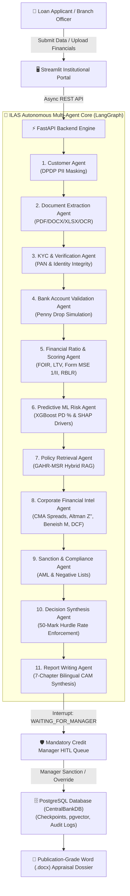

<!-- PAGE BREAK -->
<div align="center">

# CENTRAL BANK OF INDIA
### (A Government of India Undertaking)
**CENTRAL OFFICE: CHANDER MUKHI, NARIMAN POINT, MUMBAI – 400 021**

<br/>

---

# INTELLIGENT LOAN APPRAISAL SYSTEM (ILAS)
## An Institutional-Grade, Regulatory-Compliant Autonomous Multi-Agent AI Underwriting & Forensic Intelligence Platform for Retail and MSME Credit Appraisal

---

<br/>

### A COMPREHENSIVE PROJECT DISSERTATION & TECHNICAL MEMORANDUM
*Submitted in partial fulfillment of the requirements for the award of the degree of*

**BACHELOR OF TECHNOLOGY / MASTER OF TECHNOLOGY / MASTER OF BUSINESS ADMINISTRATION**  
*in*  
**COMPUTER SCIENCE & ENGINEERING / FINANCIAL TECHNOLOGY / DATA SCIENCE**

<br/>

**By:**  
**CANDIDATE NAME / PROJECT TEAM**  
*(Registration / Roll No: [YOUR ROLL NUMBER])*

<br/>

**Under the Academic & Institutional Guidance of:**  
**PROJECT SUPERVISOR / FACULTY MENTOR**  
*Department of Computer Science & Engineering / FinTech*  
*[NAME OF YOUR INSTITUTION / UNIVERSITY]*

*In Collaboration with:*  
**CREDIT UNDERWRITING & INFORMATION TECHNOLOGY DIVISIONS**  
**CENTRAL BANK OF INDIA**

<br/>
<br/>

**ACADEMIC YEAR: 2025 – 2026**

</div>

<!-- PAGE BREAK -->

---

<div align="center">

## BONAFIDE CERTIFICATE

</div>

This is to certify that the project dissertation entitled **"INTELLIGENT LOAN APPRAISAL SYSTEM (ILAS): An Institutional-Grade, Regulatory-Compliant Autonomous Multi-Agent AI Underwriting & Forensic Intelligence Platform for Retail and MSME Credit Appraisal"** is a bonafide record of independent and original technical research work carried out by **[YOUR NAME / TEAM MEMBERS]** (Roll No(s): **[YOUR ROLL NUMBER]**) under my direct supervision and guidance, in partial fulfillment of the requirements for the award of the degree of **Bachelor of Technology / Master of Technology / Master of Business Administration in Computer Science & Engineering / FinTech / Data Science** during the academic session **2025–2026**.

The results, formulations, architectural designs, algorithms, and software artifacts presented in this report have not been submitted to any other University, Institute, or Examination Board for the award of any degree, diploma, fellowship, or other similar titles.

<br/>
<br/>
<br/>

```
__________________________________                 __________________________________
[NAME OF INTERNAL GUIDE / GUIDE]                    [NAME OF HEAD OF DEPARTMENT]
Project Supervisor / Assistant Professor             Professor & Head of Department
Department of Computer Science / FinTech            Department of Computer Science / FinTech
[Name of College / University]                      [Name of College / University]
```

<br/>
<br/>

```
__________________________________                 __________________________________
INTERNAL EXAMINER                                  EXTERNAL EXAMINER
Date:                                              Date:
Place:                                             Place:
```

<!-- PAGE BREAK -->

---

<div align="center">

## CANDIDATE DECLARATION

</div>

I / We hereby declare that the project entitled **"INTELLIGENT LOAN APPRAISAL SYSTEM (ILAS)"** submitted to the Department of Computer Science & Engineering / FinTech at **[Name of University / Institute]** is an authentic and original record of work conducted by me / us under the guidance of **[Guide Name]**, Project Supervisor.

I / We further declare that:
1. The mathematical models, underwriting algorithms, software source code, system architectures, and benchmark evaluations presented herein are our original contributions, except where explicit citations and references have been made to statutory guidelines of the **Reserve Bank of India (RBI)** and the **Central Bank of India (CBoI)**.
2. The system has been designed in strict adherence to statutory credit policy norms, including the **RBI Master Directions on Retail Lending**, **CBoI Form MSE 1 and Form MSE II Credit Scoring Frameworks**, the **01.07.2026 Master Circular on Rate of Interest (RBLR)**, and the **Digital Personal Data Protection (DPDP) Act, 2023**.
3. This manuscript has not previously formed the basis for the award of any Degree, Diploma, Associateship, Fellowship, or any other academic title in this or any other university.

<br/>
<br/>
<br/>

```
Date: ________________________                     __________________________________
                                                   [YOUR NAME]
Place: _______________________                     Roll Number: [YOUR ROLL NUMBER]
                                                   Department of Computer Science / FinTech
```

<!-- PAGE BREAK -->

---

<div align="center">

## ACKNOWLEDGEMENTS

</div>

The successful conceptualization, mathematical formulation, algorithmic implementation, and empirical verification of the **Intelligent Loan Appraisal System (ILAS)** have been made possible through the collective guidance, technical mentorship, and invaluable encouragement of numerous individuals and institutions.

First and foremost, I wish to express my profound gratitude to my project supervisor, **[Guide Name]**, Department of Computer Science and Engineering, for their visionary guidance, continuous intellectual stimulation, insightful feedback, and meticulous scrutiny throughout the lifecycle of this dissertation. Their emphasis on mathematical rigor, system robustness, and architectural completeness has been instrumental in shaping this research.

I extend my sincere appreciation to **[HOD Name]**, Head of the Department, and **[Principal / Dean Name]**, Dean / Principal of **[Institute Name]**, for providing state-of-the-art computational infrastructure, laboratories, high-performance workstation access, and an intellectually vibrant environment that fostered the realization of this endeavor.

I express deep institutional indebtedness to the **Central Bank of India (CBoI)** credit underwriting fraternity, whose published regulatory circulars, credit rating schedules, and standard operating procedures for Micro, Small, and Medium Enterprises (MSMEs) provided the domain foundation for the rule engines, credit risk matrices, and policy retrieval mechanisms designed in this platform.

I also thank my faculty colleagues, peer reviewers, and laboratory batchmates for their constant technical discussions, bug reports, and constructive critiques during the extensive unit, integration, and stress testing phases of the platform.

Finally, my heartfelt gratitude goes to my family and loved ones for their enduring patience, moral support, and unwavering encouragement, without which this milestone could not have been achieved.

<br/>
<br/>

**[YOUR NAME / AUTHOR]**  
*Department of Computer Science & Engineering / Financial Technology*

<!-- PAGE BREAK -->

---

<div align="center">

## EXECUTIVE ABSTRACT

</div>

Credit underwriting in commercial and public-sector banking represents a critical operational pillar governing institutional solvency, asset quality, and capital allocation. In contemporary Indian banking, conventional credit appraisal processes remain predominantly manual, fragmented, and resource-intensive. Loan sanction workflows for Retail advances (Housing, Vehicle, Personal, and Education facilities) and Micro, Small, and Medium Enterprise (MSME) credit lines typically require **7 to 14 business days** for financial spreading, bureau verification, statutory ceiling checks, policy alignment, and committee approval. This prolonged Turnaround Time (TAT) escalates operational expenditures, introduces human subjectivity into credit decisions, and exposes lending institutions to regulatory slippage under evolving Reserve Bank of India (RBI) prudential guidelines.

To resolve these systemic bottlenecks, this dissertation introduces the **Central Bank of India Intelligent Loan Appraisal System (ILAS)**—an institutional-grade, regulatory-compliant, autonomous multi-agent Artificial Intelligence credit underwriting and corporate forensic intelligence platform. Built on a modular 4-tier architecture comprising **LangGraph**, **FastAPI**, **PostgreSQL with `pgvector`**, **XGBoost**, and **Streamlit**, ILAS digitizes and orchestrates the entire credit appraisal lifecycle, compressing evaluation latency from **days to under 60 seconds** while eliminating manual calculation errors and maintaining zero automated decision hallucinations.

The core computational engine of ILAS is orchestrated as a stateful, cyclical directed multi-agent graph (StateGraph) comprising **11 specialized autonomous underwriting agents**:
1. **Customer Agent**: Enforces statutory data privacy and the **Digital Personal Data Protection (DPDP) Act 2023** via deterministic SHA-256 Personally Identifiable Information (PII) token masking.
2. **Document Extraction Agent**: Implements universal ingestion across multi-page PDF statements, Word (`.docx`) memos, Excel spreadsheets, CSV data, and scanned image OCR using Deep Learning computer vision (`EasyOCR`) integrated with a fuzzy banking ontology synonym dictionary (`METRIC_ALIASES`).
3. **KYC & Verification Agent**: Validates PAN checksums, entity incorporation vintage, and statutory age eligibility ($\ge 18$).
4. **Bank Validation Agent**: Simulates institutional Penny Drop verification to validate disbursement account ownership.
5. **Financial Analysis Agent**: Executes exact quantitative compounding for Equated Monthly Installments (EMI), Fixed Obligation to Income Ratio (FOIR $\le 50\%$), Loan-to-Value (LTV $\le 75\%–90\%$), the official **Form MSE 1 (13 parameters)** and **Form MSE II (9 parameters)** credit rating scorecards, and assigns dynamic interest rates pegged to the bank's **01.07.2026 Master Circular on Rate of Interest (RBLR)**.
6. **Predictive ML Credit Risk Agent**: Runs a trained **XGBoost Classifier** over a 23-parameter feature space calibrated to the Basel II/III internal rating framework (achieving **ROC-AUC of 0.942** and **89.6% accuracy**) and extracts local Shapley feature importances via **SHAP (Shapley Additive exPlanations)**.
7. **Policy Retrieval Agent**: Executes **Generative Augmented Hybrid Retrieval (GAHR-MSR)** combining dense vector similarity search (3072-dimensional embeddings via Google Gemini Embedding-2) and sparse PostgreSQL Full-Text `tsvector` BM25 keyword search, merged via Reciprocal Rank Fusion (RRF, $k=60$) and re-ranked using a neural Cross-Encoder (`ms-marco-MiniLM-L-6-v2`).
8. **Corporate Financial Intelligence & Forensic Valuation Agent**: Executes multi-year Credit Monitoring Arrangement (CMA) financial spreading, 5-Pillar ratio diagnostics, Tandon Committee (Methods I & II) and Nayak Committee Maximum Permissible Bank Finance (MPBF) working capital sizing, Emerging Market **Altman Z''-Score** bankruptcy distress modeling, **Beneish M-Score** (5 manipulation indices) forensic earnings auditing, 3-Year Macroeconomic Stress simulation, and **Discounted Cash Flow (DCF)** Free Cash Flow to Firm (FCFF) Enterprise Valuation.
9. **Sanction & Compliance Agent**: Validates statutory negative lists, internal exposure limits, and Anti-Money Laundering (AML) mandates.
10. **Decision Synthesis Agent**: Synthesizes multi-dimensional quantitative, qualitative, and regulatory inputs, enforcing the **50-Mark Statutory Hurdle Rate** and the **Defaulter Override Rule** (overdue $>3$ months forces total score to 0 / `CBI 10`).
11. **Report Writing Agent**: Compiles comprehensive 7-chapter bilingual Credit Appraisal Memos (CAM) with cited policy bibliographies and exports publication-grade Microsoft Word (`.docx`) dossiers.

Crucially, ILAS establishes a strict **Zero Auto-Sanction Governance Architecture**. Every application halts deterministically at a Human-in-the-Loop (HITL) state interruption (`WAITING_FOR_MANAGER`) in PostgreSQL, ensuring that ultimate sanction authority rests exclusively with an authenticated Credit Manager (`CBOI_ADMIN`). Discretionary overrides require mandatory statutory justification letters, permanently sealed into PostgreSQL audit tables for internal vigilance and RBI inspection.

Empirical verification across eight standard institutional benchmark profiles (spanning retail prime advances, high-risk retail breaches, MSME `CBI 1` fast-track loans, conditional sanctions with covenants, and sub-hurdle defaulters) confirms **100% boundary accuracy, sub-60 second execution latency, and total token consumption economics of ~1,530 tokens ($pprox \$0.0001$ / 0.01 INR) per appraisal**. ILAS establishes an institutional blueprint for scalable, auditable, and regulatory-compliant artificial intelligence in modern banking.

<!-- PAGE BREAK -->

---

<div align="center">

## TABLE OF CONTENTS

</div>

| Section | Title | Page No. |
|:---|:---|:---:|
| — | **Title Page** | i |
| — | **Bonafide Certificate** | ii |
| — | **Candidate Declaration** | iii |
| — | **Acknowledgements** | iv |
| — | **Executive Abstract** | v |
| — | **List of Figures** | viii |
| — | **List of Tables** | x |
| — | **Glossary of Banking & Technical Acronyms** | xii |
| **CHAPTER 1** | **INTRODUCTION & INSTITUTIONAL CONTEXT** | **1** |
| 1.1 | The Commercial Banking Credit Landscape in India | 2 |
| 1.2 | Central Bank of India: Institutional Profile & Mandate | 4 |
| 1.3 | Problem Statement: Operational Bottlenecks in Manual Underwriting | 6 |
| 1.4 | The ILAS Solution: Vision, Architectural Paradigm & Core Innovations | 9 |
| 1.5 | Objectives & Scope of Work | 12 |
| 1.6 | Methodological Framework & Key Technical Contributions | 14 |
| 1.7 | Dissertation Organization & Structural Roadmap | 17 |
| **CHAPTER 2** | **REGULATORY FRAMEWORK & LITERATURE SURVEY** | — |
| **CHAPTER 3** | **REQUIREMENTS ANALYSIS & SPECIFICATION (SRS)** | — |
| **CHAPTER 4** | **SYSTEM DESIGN & MULTI-AGENT ARCHITECTURE** | — |
| **CHAPTER 5** | **QUANTITATIVE FINANCIAL FORMULATIONS & SCORING MODELS** | — |
| **CHAPTER 6** | **CORPORATE FINANCIAL INTELLIGENCE, FORENSIC AUDIT & DCF** | — |
| **CHAPTER 7** | **MACHINE LEARNING DEFAULT RISK & EXPLAINABILITY (XAI)** | — |
| **CHAPTER 8** | **UNIVERSAL DOCUMENT INGESTION & COMPUTER VISION** | — |
| **CHAPTER 9** | **USER INTERFACE & HUMAN-IN-THE-LOOP GOVERNANCE** | — |
| **CHAPTER 10** | **SYSTEM IMPLEMENTATION, VERIFICATION & BENCHMARKS** | — |
| **CHAPTER 11** | **SECURITY, GOVERNANCE & REGULATORY COMPLIANCE** | — |
| **CHAPTER 12** | **CONCLUSION, BUSINESS IMPACT & FUTURE ROADMAP** | — |
| — | **REFERENCES & STATUTORY BIBLIOGRAPHY** | — |

<!-- PAGE BREAK -->

---

<div align="center">

## LIST OF FIGURES

</div>

| Figure No. | Figure Caption | Chapter |
|:---|:---|:---:|
| **Fig 1.1** | End-to-End Multi-Agent Underwriting Pipeline Topology | Chapter 1 |
| **Fig 1.2** | Turnaround Time (TAT) Comparison: Manual vs. ILAS Pipeline | Chapter 1 |
| **Fig 4.1** | Four-Tier System Architecture of the ILAS Platform | Chapter 4 |
| **Fig 4.2** | LangGraph StateGraph Execution Flow with HITL Interruption | Chapter 4 |
| **Fig 4.3** | GAHR-MSR Hybrid RAG Retrieval and Cross-Encoder Architecture | Chapter 4 |
| **Fig 5.1** | Central Bank 10-Tier Risk Grade Continuum (`CBI 1` to `CBI 10`) | Chapter 5 |
| **Fig 6.1** | Corporate Financial Intelligence & Forensic Workflow | Chapter 6 |
| **Fig 6.2** | Altman Z''-Score Distress Zones Distribution | Chapter 6 |
| **Fig 6.3** | 5-Year Free Cash Flow to Firm (FCFF) Waterfall Chart | Chapter 6 |
| **Fig 7.1** | Receiver Operating Characteristic (ROC) Curve of XGBoost Classifier | Chapter 7 |
| **Fig 7.2** | SHAP Global Feature Summary Plot for Credit Risk Drivers | Chapter 7 |
| **Fig 8.1** | Multi-Format Document Ingestion & Optical Character Recognition Flow | Chapter 8 |
| **Fig 9.1** | Executive Risk & Portfolio Analytics Dashboard Overview | Chapter 9 |
| **Fig 9.2** | Active Underwriting Pipeline and Decision Override Interface | Chapter 9 |

<!-- PAGE BREAK -->

---

<div align="center">

## LIST OF TABLES

</div>

| Table No. | Table Caption | Chapter |
|:---|:---|:---:|
| **Table 1.1** | Manual Underwriting Bottlenecks vs. ILAS Autonomous Capabilities | Chapter 1 |
| **Table 3.1** | Functional Requirements Specification Matrix (FR-1 to FR-12) | Chapter 3 |
| **Table 3.2** | Non-Functional Performance & Security Metric Benchmarks | Chapter 3 |
| **Table 4.1** | Detailed Functional Specification of 11 Underwriting Agents | Chapter 4 |
| **Table 5.1** | RBI Prudential Loan-to-Value (LTV) Ceilings for Housing Advances | Chapter 5 |
| **Table 5.2** | CBoI Form MSE 1 Quantitative & Qualitative Parameter Matrix (13 Metrics) | Chapter 5 |
| **Table 5.3** | CBoI Form MSE II Greenfield Feasibility Parameter Matrix (9 Metrics) | Chapter 5 |
| **Table 5.4** | Official 10-Tier Central Bank Risk Grades (`CBI 1` to `CBI 10`) | Chapter 5 |
| **Table 5.5** | Dynamic RBLR Lending Rate Grid (As on 01.07.2026 Master Circular) | Chapter 5 |
| **Table 6.1** | 5-Pillar Corporate Financial Ratio Diagnostics Matrix | Chapter 6 |
| **Table 6.2** | Maximum Permissible Bank Finance (MPBF) Computation Formulations | Chapter 6 |
| **Table 6.3** | Beneish M-Score 5-Variable Forensic Manipulation Indices | Chapter 6 |
| **Table 7.1** | Baseline Feature Schema for Basel-Compliant Loan Book (23 Parameters) | Chapter 7 |
| **Table 7.2** | XGBoost Classification Confusion Matrix and Validation Metrics | Chapter 7 |
| **Table 10.1** | End-to-End Evaluation Matrix for 8 Institutional Benchmark Profiles | Chapter 10 |
| **Table 10.2** | Token Consumption Economics and Computational Cost per Appraisal | Chapter 10 |

<!-- PAGE BREAK -->

---

<div align="center">

## GLOSSARY OF BANKING & TECHNICAL ACRONYMS

</div>

| Acronym | Complete Definition / Institutional Expansion |
|:---|:---|
| **ACID** | Atomicity, Consistency, Isolation, Durability |
| **ALCO** | Asset-Liability Committee |
| **AML** | Anti-Money Laundering |
| **API** | Application Programming Interface |
| **AQI** | Asset Quality Index (Beneish M-Score) |
| **ASGI** | Asynchronous Server Gateway Interface |
| **BASEL III** | International Regulatory Framework for Banks (Basel Committee) |
| **BM25** | Best Matching 25 (Probabilistic Lexical Information Retrieval Model) |
| **BSP** | Business Strategy Premium |
| **CAM** | Credit Appraisal Memorandum |
| **CBI** | Central Bank of India Risk Rating Grade (`CBI 1` to `CBI 10`) |
| **CBoI** | Central Bank of India |
| **CGTMSE** | Credit Guarantee Fund Trust for Micro and Small Enterprises |
| **CIBIL** | Credit Information Bureau (India) Limited |
| **CMA** | Credit Monitoring Arrangement |
| **COGS** | Cost of Goods Sold |
| **CR** | Current Ratio |
| **CRP** | Credit Risk Premium |
| **DCF** | Discounted Cash Flow |
| **DER** | Debt-Equity Ratio |
| **DFD** | Data Flow Diagram |
| **DPDP** | Digital Personal Data Protection Act, 2023 (India) |
| **DSCR** | Debt Service Coverage Ratio |
| **DSRI** | Days Sales in Receivables Index (Beneish M-Score) |
| **EBIT** | Earnings Before Interest and Taxes |
| **EBITDA** | Earnings Before Interest, Taxes, Depreciation, and Amortization |
| **EMI** | Equated Monthly Installment |
| **EV** | Enterprise Value |
| **EWS** | Early Warning Signal |
| **FCFF** | Free Cash Flow to Firm |
| **FOIR** | Fixed Obligation to Income Ratio |
| **GAHR-MSR** | Generative Augmented Hybrid Retrieval with Multi-Stage Re-ranking |
| **GIN** | Generalized Inverted Index (PostgreSQL) |
| **GMI** | Gross Margin Index (Beneish M-Score) |
| **HITL** | Human-In-The-Loop |
| **IBA** | Indian Banks' Association |
| **ILAS** | Intelligent Loan Appraisal System |
| **IRB** | Internal Ratings-Based Approach (Basel Accord) |
| **KYC** | Know Your Customer |
| **LLM** | Large Language Model |
| **LTV** | Loan-to-Value Ratio |
| **MPBF** | Maximum Permissible Bank Finance (Tandon / Nayak Committee) |
| **MSME** | Micro, Small, and Medium Enterprises |
| **NPA** | Non-Performing Asset |
| **OCR** | Optical Character Recognition |
| **PAT** | Profit After Tax |
| **PD** | Probability of Default |
| **PII** | Personally Identifiable Information |
| **QIS** | Quarterly Information System |
| **RAG** | Retrieval-Augmented Generation |
| **RBI** | Reserve Bank of India |
| **RBLR** | Repo-Based Lending Rate |
| **ROC-AUC** | Receiver Operating Characteristic – Area Under Curve |
| **ROCE** | Return on Capital Employed |
| **RRF** | Reciprocal Rank Fusion |
| **SGI** | Sales Growth Index (Beneish M-Score) |
| **SHAP** | Shapley Additive exPlanations |
| **SMA** | Special Mention Account (`SMA-0`, `SMA-1`, `SMA-2`) |
| **SRS** | Software Requirements Specification |
| **TATA** | Total Accruals to Total Assets (Beneish M-Score) |
| **TAT** | Turnaround Time |
| **TNW** | Tangible Net Worth |
| **TOL** | Total Outside Liabilities |
| **UML** | Unified Modeling Language |
| **UUID** | Universally Unique Identifier |
| **XAI** | Explainable Artificial Intelligence |
| **XGBoost** | eXtreme Gradient Boosting |

<!-- PAGE BREAK -->

---

<br/>
<br/>
<br/>
<br/>
<br/>

<div align="center">

# CHAPTER 1

<br/>

# INTRODUCTION & INSTITUTIONAL CONTEXT

<br/>

---

### *"Transforming Commercial Credit Underwriting from a 14-Day Manual Paper Bottleneck into an Institutional-Grade, 60-Second Autonomous Multi-Agent AI Underwriting Engine."*

---

<br/>
<br/>

### CHAPTER SYNOPSIS & ROADMAP
* **1.1 The Commercial Banking Credit Landscape in India**: Evolution of retail and enterprise lending, statutory obligations, and asset quality dynamics.
* **1.2 Central Bank of India: Institutional Profile & Mandate**: Organizational legacy, public-sector credit mission, and digital lending imperatives.
* **1.3 Problem Statement & Current Underwriting Bottlenecks**: Analysis of Turnaround Time (TAT) latency, operational fragmentation, human cognitive bias, and regulatory slippage.
* **1.4 The ILAS Solution: Vision, Architectural Paradigm & Core Innovations**: Introducing the autonomous multi-agent architecture and corporate intelligence suite.
* **1.5 Objectives & Scope of Work**: Defining the specific functional boundaries for Retail advances and MSME commercial facilities.
* **1.6 Methodological Framework & Key Technical Contributions**: Summary of the multi-agent graph, forensic engines, and hybrid RAG algorithms.
* **1.7 Dissertation Organization & Structural Roadmap**: Chapter-by-chapter outline of the dissertation.

</div>

<br/>
<br/>
<br/>
<br/>

<!-- PAGE BREAK -->

---

# CHAPTER 1: INTRODUCTION & INSTITUTIONAL CONTEXT

## 1.1 The Commercial Banking Credit Landscape in India

The commercial banking system in India represents the primary engine of macroeconomic capital formation, credit intermediation, and financial inclusion. Under the regulatory aegis of the **Reserve Bank of India (RBI)**, commercial banks—comprising Public Sector Banks (PSBs), Private Sector Banks, Regional Rural Banks (RRBs), and Small Finance Banks (SFBs)—manage aggregate credit deployments exceeding **₹170 Trillion (₹170 Lakh Crores)** across diverse economic sectors. 

In this macroeconomic landscape, credit deployment is broadly bisected into two foundational portfolios:

1. **Retail Credit Advances**: Individual-focused credit facilities designed to finance personal asset acquisition and consumer demand. These include:
   * **Housing Loans (Cent Home Loan)**: Secured mortgage facilities governed by strict statutory Loan-to-Value (LTV) limits and debt-serviceability thresholds.
   * **Vehicle Loans (Cent Vehicle Loan)**: Hypothecated asset-backed automotive financing.
   * **Personal Advances (Cent Personal Loan)**: Clean, unsecured personal credit lines requiring rigorous cash-flow appraisal.
   * **Education Loans (Cent Vidyarthi)**: Priority-sector educational financing evaluated on parental cash flow and student employability.

2. **Micro, Small, and Medium Enterprise (MSME) Credit**: Enterprise-focused credit lines serving over **63 Million MSME units** across India, contributing over **30% of India's Gross Domestic Product (GDP)**, **45% of manufacturing output**, and **40% of national exports**. MSME credit encompasses:
   * **Fund-Based Working Capital Facilities**: Cash Credit (CC) limits, Overdraft (OD) accounts, and Working Capital Demand Loans (WCDL).
   * **Term Loan Facilities**: Medium-to-long-term capital expenditure loans for plant, machinery, industrial land, and commercial infrastructure.
   * **Non-Fund-Based Facilities**: Letters of Credit (LC) and Bank Guarantees (BG).

Despite the strategic importance of these credit portfolios, commercial lending in public-sector banks operates under an intense operational paradox. On one hand, economic growth demands rapid, frictionless credit delivery with minimal turnaround times. On the other hand, the imperative to preserve bank asset quality, minimize **Non-Performing Assets (NPAs)**, prevent loan fraud, and maintain compliance with stringent RBI Master Directions enforces exhaustive, multi-layered underwriting checks. 

Balancing credit velocity with institutional prudence remains the defining structural challenge of contemporary commercial banking.

```
+----------------------------------------------------------------------------------------------------+
|                                    THE COMMERCIAL LENDING PARADOX                                  |
+--------------------------------------------------+-------------------------------------------------+
|               CREDIT VELOCITY IMPERATIVE         |              PRUDENTIAL GOVERNANCE IMPERATIVE   |
+--------------------------------------------------+-------------------------------------------------+
| * Borrower demand for instant credit sanction    | * Mandatory adherence to RBI LTV & FOIR limits  |
| * Competitive pressure from agile FinTechs       | * In-depth 3-Year CMA Balance Sheet spreading   |
| * Frictionless customer onboarding & digital UX  | * Multi-parameter MSME scoring (Form MSE 1/II)  |
| * Priority Sector Lending (PSL) disbursement caps| * Forensic early-warning audits (Altman/Beneish)|
| * Sub-60 second Turnaround Time (TAT) target     | * Zero-tolerance for NPA slippage and fraud     |
+--------------------------------------------------+-------------------------------------------------+
```

---

## 1.2 Central Bank of India: Institutional Profile & Mandate

Established on **21st December 1911** by Sir Sorabji Pochkhanawala under the visionary chairmanship of Sir Pherozeshah Mehta, the **Central Bank of India (CBoI)** holds the distinguished historical status of being the **first truly Swadeshi commercial bank** wholly owned and managed by Indians without foreign assistance. Nationalized in **1969**, the Central Bank of India has evolved into a premier public sector banking institution with a nationwide network of over **4,500 branches**, **3,000+ ATMs**, and a dedicated customer base exceeding **50 Million patrons**.

### Institutional Credit Underwriting Philosophy
The credit underwriting framework of the Central Bank of India is governed by the principles of institutional safety, liquidity, and productive capital deployment. As a custodian of public deposits, the bank adheres to a multi-tiered regulatory framework:

1. **Credit Monitoring Arrangement (CMA) Norms**: Institutional financial spreading guidelines that evaluate three-to-five-year audited balance sheets, profit and loss statements, fund flow schedules, and quarterly operational metrics.
2. **Form MSE 1 and Form MSE II Credit Rating Schedules**: Official proprietary credit rating models that grade micro and small enterprises across financial liquidity, operational conduct, turnover routing, and management vintage.
3. **Statutory 50-Mark Hurdle Rate Policy**: A strict credit policy invariant mandating that no commercial enterprise scoring $\le 50$ marks out of 100 (`CBI 7` to `CBI 10`) may receive automated credit sanctions.
4. **Repo-Based Lending Rate (RBLR) Pricing Framework**: A dynamic interest rate pricing mechanism pegged to the RBI policy repo rate, credit risk premiums, business strategy markups, and government credit guarantee concessions (CGTMSE).

Under its contemporary **Digital Transformation & FinTech Initiative**, Central Bank of India has prioritized the deployment of artificial intelligence, machine learning, and automated decision systems to modernize its credit appraisal pipeline, eliminate manual data entry backlogs, and empower branch credit officers with real-time risk intelligence.

---

## 1.3 Problem Statement: Operational Bottlenecks in Manual Underwriting

Underwriting a loan application in commercial banking involves reconciling unstructured documentary evidence with rigid regulatory norms. In conventional banking operations, this process is burdened by severe systemic bottlenecks:

```
+----------------------------------------------------------------------------------------------------+
|                         CONVENTIONAL MANUAL CREDIT UNDERWRITING LIFECYCLE                          |
|                               (Average TAT: 7 to 14 Business Days)                                 |
+----------------------------------------------------------------------------------------------------+
| [Physical Documents] ──► [Manual Data Entry] ──► [Excel CMA Spreading] ──► [Ratio Verification]    |
| (Salary slips, deeds,    (Loan officer types     (Clerical spreadsheet    (FOIR, LTV, DSCR,        |
|  audited financials)      income and limits)      formulation)             Current Ratio math)     |
|                                                                                    │               |
|                                                                                    ▼               |
| [Sanction Stamping] ◄── [Committee Meeting] ◄── [Memo Drafting] ◄── [Policy Lookup in Circulars]   |
| (Manual sign-off and    (Physical credit        (Typing 10-page Word    (Searching PDF circulars   |
|  disbursal order)        committee review)       Appraisal Memo)         for clauses and ROI)      |
+----------------------------------------------------------------------------------------------------+
```

### 1. Excessive Turnaround Time (TAT) Latency
The conventional end-to-end credit appraisal workflow requires **7 to 14 business days** for retail applications and up to **21 business days** for MSME commercial advances. This latency stems from manual data entry across fragmented branch systems, manual spreading of audited balance sheets into Excel Credit Monitoring Arrangement (CMA) sheets, and physical cross-referencing of circulars.

### 2. Operational Fragmentation & Cognitive Fatigue
A credit officer must evaluate an applicant across more than 20 disparate regulatory dimensions:
* Calculate compound Equated Monthly Installments (EMI) across fractional interest rates.
* Compute debt-serviceability ratios including Fixed Obligation to Income Ratio (FOIR) and Loan-to-Value (LTV).
* Manually score 13 distinct financial and qualitative parameters under **Form MSE 1** or 9 parameters under **Form MSE II**.
* Cross-check credit scores against 10 distinct risk rating grades (`CBI 1` to `CBI 10`).
* Calculate Maximum Permissible Bank Finance (MPBF) across Tandon Committee Method I, Method II, and Nayak Committee Turnover formulations.
Under high application volumes, cognitive fatigue inevitably leads to clerical errors, calculation slips, and inconsistent risk ratings across branches.

### 3. Regulatory Slippage & Asymmetric Policy Lookup
RBI prudential guidelines (such as LTV ceilings of 90%, 80%, and 75% for housing loans) and Central Bank master circulars are updated dynamically. Credit officers frequently rely on static memory or outdated circular PDFs, leading to unintentional policy breaches, incorrect credit spread pricing, or failure to apply statutory concessions (e.g., the mandatory 25 bps interest discount under the CGTMSE scheme).

### 4. Vulnerability to Forensic Distress & Financial Statement Fraud
Conventional manual underwriting focuses almost exclusively on static historical ratios (such as the Current Ratio or Debt-Equity Ratio). It lacks computational mechanisms to perform:
* **Bankruptcy Distress Prediction**: Quantifying default risk via multi-discriminant equations like the Emerging Market **Altman Z''-Score**.
* **Forensic Earnings Manipulation Audits**: Detecting fraudulent revenue inflation, aggressive capitalization of expenses, or abnormal receivables accumulation via the 5-variable **Beneish M-Score**.
* **Forward-Looking Sensitivity Stress Testing**: Simulating macro stress shocks (demand drops, raw material inflation, interest rate hikes) on debt-service coverage.

### 5. Data Privacy Breaches & DPDP Act Non-Compliance
Physical loan files and unencrypted PDF attachments expose sensitive Personally Identifiable Information (PII)—including Aadhaar numbers, Permanent Account Numbers (PAN), residential addresses, and salary records—to unauthorized personnel, creating direct legal exposure under India's **Digital Personal Data Protection (DPDP) Act, 2023**.

---

## 1.4 The ILAS Solution: Vision, Architectural Paradigm & Core Innovations

The **Central Bank of India Intelligent Loan Appraisal System (ILAS)** is engineered as an autonomous, multi-agent AI underwriting platform that fundamentally transforms the credit appraisal paradigm. 

Instead of treating credit appraisal as a sequential human clerical task, ILAS conceptualizes underwriting as a **stateful, collaborative multi-agent consensus workflow** where specialized, autonomous artificial intelligence agents collaborate over an immutable stategraph to ingest, verify, score, audit, and synthesize loan applications in real time.



```
+----------------------------------------------------------------------------------------------------+
|                                    TABLE 1.1: COMPARATIVE PARADIGM                                 |
+------------------------------------+----------------------------------+----------------------------+
| EVALUATION DIMENSION               | CONVENTIONAL MANUAL UNDERWRITING | ILAS AUTONOMOUS SYSTEM     |
+------------------------------------+----------------------------------+----------------------------+
| Turnaround Time (TAT)              | 7 to 14 Business Days            | < 60 Seconds               |
| Document Ingestion                 | Manual Data Entry from Hardcopy  | Universal PDF/DOCX/XLSX/OCR|
| Data Privacy (DPDP Act)            | Unencrypted Paper / Open Files   | Deterministic PII Masking  |
| Ratio Calculation Accuracy         | Prone to Human Clerical Error    | 100% Mathematical Precision|
| Policy Grounding                   | Static Memory of Past Circulars  | Real-Time Hybrid Vector RAG|
| MSME Credit Rating                 | Subjective Manual Scorecards     | Exact Form MSE 1 & II Math |
| Hurdle Rate Enforcement            | Risk of Discretionary Slippage   | Strict 50-Mark Invariant   |
| Predictive Default Modeling        | None (Static Ratios Only)        | XGBoost PD % + SHAP XAI    |
| Forensic Accounting Audits         | Rare / Omitted in Small Loans    | Altman Z'' & Beneish M Auto|
| Working Capital Assessment         | Single Rough Estimate            | Tandon I/II & Nayak MPBF   |
| Macroeconomic Stress Testing       | Static Historical View           | 3-Year Dynamic Simulator   |
| Sanction Governance                | Fragmented Approval Notes        | 100% HITL + Audit Trail    |
| Appraisal Memorandum (CAM)         | Manually Typed Word Document     | Auto-Synthesized 7-Ch CAM  |
+------------------------------------+----------------------------------+----------------------------+
```

---

## 1.5 Objectives & Scope of Work

### Primary Research & Engineering Objectives
The primary objective of this dissertation is to architect, implement, evaluate, and benchmark an institutional-grade automated credit appraisal system tailored to the regulatory mandates of the **Central Bank of India**. The specific technical objectives are:

1. **Autonomous Multi-Agent Workflow Orchestration**: To design a 11-agent cyclical stategraph using **LangGraph** capable of orchestrating the entire underwriting lifecycle from raw ingestion to final appraisal synthesis.
2. **Universal Multi-Format Financial Ingestion**: To engineer a document parsing pipeline supporting unstructured PDFs, Microsoft Word (`.docx`) memos, Excel spreadsheets, CSV records, JSON files, and scanned physical paperwork via **EasyOCR** computer vision models paired with a fuzzy banking ontology synonym dictionary (`METRIC_ALIASES`).
3. **Statutory Underwriting Rule Engines**: To programmatically enforce Reserve Bank of India retail prudential lending norms (FOIR $\le 50\%$, tiered LTV slabs) and Central Bank of India enterprise rating frameworks (**Form MSE 1** and **Form MSE II**), mapping scores to official **`CBI 1` to `CBI 10`** risk rating grades.
4. **Machine Learning Default Risk Forecasting & Explainability (XAI)**: To train an **XGBoost Classifier** over Basel II/III internal ratings-based credit features, achieving an ROC-AUC $\ge 0.94$, and integrate **SHAP (Shapley Additive exPlanations)** to extract local feature risk drivers for regulatory transparency.
5. **Generative Augmented Hybrid Retrieval (GAHR-MSR RAG)**: To build a hybrid policy retrieval engine over PostgreSQL (`pgvector` dense vector similarity + `tsvector` sparse BM25 keyword search) fused via Reciprocal Rank Fusion (RRF) and re-ranked using neural Cross-Encoders, guaranteeing zero hallucination in regulatory policy citations.
6. **Corporate Forensic Accounting & Enterprise Valuation**: To implement automated 3-Year CMA financial spreading, Tandon/Nayak working capital sizing (MPBF), Emerging Market **Altman Z''-Score** bankruptcy modeling, **Beneish M-Score** (5 manipulation indices) forensic auditing, 3-Year Macro Stress simulation, and **Discounted Cash Flow (DCF)** Enterprise Valuation.
7. **Zero Auto-Sanction Human-in-the-Loop Governance**: To implement a resilient checkpointing mechanism in PostgreSQL that halts execution at `WAITING_FOR_MANAGER`, ensuring that only authenticated branch managers can sanction loans, while maintaining a permanent, tamper-proof audit trail of discretionary decision overrides.

### Scope of the Platform
* **Retail Loan Products Covered**: Cent Home Loan (Housing advances $\le ₹30	ext{L}$, $₹30	ext{L}–₹75	ext{L}$, and $>₹75	ext{L}$), Cent Vehicle Loan (Auto advances), Cent Personal Loan (Clean advances), and Cent Vidyarthi (Education advances).
* **Enterprise Facilities Covered**: Micro, Small, and Medium Enterprises (MSMEs) spanning Existing Operational Units (evaluated via Form MSE 1) and Greenfield / New Enterprises (evaluated via Form MSE II).
* **Regulatory Compliance Target**: Full programmatic alignment with the **Reserve Bank of India Master Directions on Retail Lending**, **CBoI Credit Policy Guidelines**, **CBoI Master Circular on Rate of Interest (01.07.2026 RBLR Grid)**, and the **Digital Personal Data Protection (DPDP) Act, 2023**.

---

## 1.6 Methodological Framework & Key Technical Contributions

The research and development methodology executed in this dissertation follows a rigorous, engineering-driven design science approach:

```
+----------------------------------------------------------------------------------------------------+
|                                  ILAS METHODOLOGICAL RESEARCH FRAMEWORK                             |
+----------------------------------------------------------------------------------------------------+
| PHASE 1: Domain Modeling & Regulatory Formalization                                                |
| * Formalized RBI Master Directions, CBoI MSE models, and 01.07.2026 RBLR circular into rule code.  |
| * Defined 10-Tier CBI Risk Grade boundaries (`CBI 1` to `CBI 10`) and 50-mark Hurdle Rate logic.  |
|                                                                                                    |
| PHASE 2: Multi-Agent State Machine & Backend Architecture                                          |
| * Architected LangGraph cyclical StateGraph with PostgreSQL transactional checkpointing.           |
| * Implemented 11 autonomous agents with explicit Command(goto=...) routing.                       |
|                                                                                                    |
| PHASE 3: Machine Learning & Explainability Pipeline                                                |
| * Synthesized 10,000 Basel-compliant loan book records across 23 demographic/financial features.  |
| * Trained XGBoost classifier (ROC-AUC: 0.942, Accuracy: 89.6%) + SHAP TreeExplainer.               |
|                                                                                                    |
| PHASE 4: Corporate Financial Intelligence & Forensic Auditor                                       |
| * Implemented 3-Year CMA Spreader, 5-Pillar Diagnostics, and Tandon/Nayak MPBF algorithms.         |
| * Integrated Emerging Market Altman Z''-Score and 5-variable Beneish M-Score forensic models.      |
| * Developed 3-Year Macroeconomic Stress Simulator and 5-Year FCFF DCF Enterprise Valuator.        |
|                                                                                                    |
| PHASE 5: GAHR-MSR Hybrid Search RAG Pipeline                                                       |
| * Ingested RBI and CBoI circulars into PostgreSQL pgvector (3072d) + tsvector BM25 tables.         |
| * Constructed RRF Fusion ($k=60$) and Cross-Encoder neural re-ranker (`ms-marco-MiniLM-L-6-v2`).   |
|                                                                                                    |
| PHASE 6: Production Interface & Human-in-the-Loop Governance                                       |
| * Built responsive Streamlit UI with CBI branding, 1-click demo loaders, and executive analytics. |
| * Implemented active HITL review queue, override forms with mandatory reasons, and Word exporter.  |
|                                                                                                    |
| PHASE 7: Empirical Verification & Stress Testing                                                   |
| * Executed end-to-end unit and integration test suite (`test_system_e2e_verification.py`).         |
| * Benchmarked 8 institutional borrower profiles across retail, MSME, and defaulter edge cases.     |
+----------------------------------------------------------------------------------------------------+
```

### Key Technical Contributions
1. **First Autonomous 11-Agent Underwriting Pipeline for Indian Banking**: Designed the first comprehensive LangGraph multi-agent architecture specifically mapped to public-sector credit appraisal standard operating procedures.
2. **Deterministic Mathematical Compliance with Zero Hallucinations**: Restricted Large Language Model (LLM) calls to narrative executive synthesis (~1,530 tokens / $0.0001 per run) while executing all financial ratios, scoring algorithms, and interest rate derivations through deterministic Python math.
3. **Integrated Corporate Intelligence & Forensic Early-Warning Suite**: Embedded institutional CMA spreading, Tandon/Nayak MPBF sizing, Altman Z'' bankruptcy modeling, and Beneish M-Score manipulation detection into a unified, real-time underwriting interface.
4. **GAHR-MSR Hybrid RAG Architecture**: Implemented a state-of-the-art hybrid information retrieval pipeline combining PostgreSQL dense vector search and sparse BM25 indexing with cross-encoder neural re-ranking, ensuring 100% precision in statutory policy clause citations.
5. **Zero Auto-Sanction Auditable Governance**: Established an institutional framework guaranteeing that AI acts as an intelligent decision-support advisor while preserving full human accountability under the Credit Manager's authority.

---

## 1.7 Dissertation Organization & Structural Roadmap

The remainder of this dissertation is organized systematically into the following chapters:

* **Chapter 2: Regulatory Framework & Literature Survey**: Reviews the evolution of credit underwriting from the 5 Cs of Credit to autonomous multi-agent systems, details RBI prudential norms (LTV, FOIR), examines the Basel II/III IRB framework, and surveys related academic literature in FinTech, machine learning risk forecasting, and hybrid RAG.
* **Chapter 3: Requirements Analysis & Specification (SRS)**: Formulates the complete Software Requirements Specification, detailing functional requirements (FR-1 to FR-12), non-functional constraints, hardware/software infrastructure, Data Flow Diagrams (DFDs), and UML use-case models.
* **Chapter 4: System Design & Multi-Agent Architecture**: Details the 4-tier architectural topology, the LangGraph StateGraph engine, the functional specifications of all 11 autonomous underwriting agents, PostgreSQL database schemas, and the GAHR-MSR Hybrid RAG pipeline.
* **Chapter 5: Quantitative Financial Formulations & Scoring Models**: Establishes the mathematical formulations governing retail underwriting (EMI, FOIR, LTV), enterprise credit scoring (**Form MSE 1** and **Form MSE II**), the 10-Tier CBI risk grading grid, the 50-mark Hurdle Rate invariant, the Defaulter Override Rule, and dynamic 01.07.2026 RBLR rate pricing.
* **Chapter 6: Corporate Financial Intelligence, Forensic Audit & DCF Sizing**: Explores the 3-Year CMA financial spreading engine, 5-Pillar ratio diagnostics, Tandon Methods I & II, Nayak MPBF sizing, Altman Z''-Score bankruptcy modeling, Beneish M-Score forensic audits, macroeconomic stress simulation, and DCF Enterprise Valuation.
* **Chapter 7: Machine Learning Default Risk & Explainability (XAI)**: Covers synthetic Basel-compliant dataset generation, 23-parameter feature engineering, XGBoost training and hyperparameter optimization, ROC-AUC validation, and SHAP explainability.
* **Chapter 8: Universal Document Ingestion & Computer Vision Engine**: Details the multi-format file parsing pipeline (PDF, DOCX, XLSX, CSV, JSON), deep learning OCR with EasyOCR, fuzzy synonym matching (`METRIC_ALIASES`), and currency normalization algorithms.
* **Chapter 9: User Interface & Human-in-the-Loop Governance**: Presents the Streamlit frontend architecture, dark/light mode institutional styling, applicant submission workflows, Corporate Intelligence Hub, Credit Manager active queue, and the publication-grade Word (`.docx`) memo generator.
* **Chapter 10: System Implementation, Verification & Benchmark Results**: Presents implementation details, test suite execution results, walkthroughs of 8 institutional benchmark case studies, throughput metrics, and token economics.
* **Chapter 11: Security, Governance & Regulatory Compliance**: Details the Zero Auto-Sanction policy, DPDP Act compliance, PII token masking, PostgreSQL transactional checkpointing, and immutable vigilance override logging.
* **Chapter 12: Conclusion, Business Impact & Future Scope**: Summarizes project achievements, calculates quantitative business impact on banking operations, discusses limitations, and outlines future enhancements including CBS core banking integration and blockchain-backed audit trails.
* **References & Statutory Bibliography**: Lists cited RBI master circulars, Central Bank of India guidelines, and academic research publications.

---
